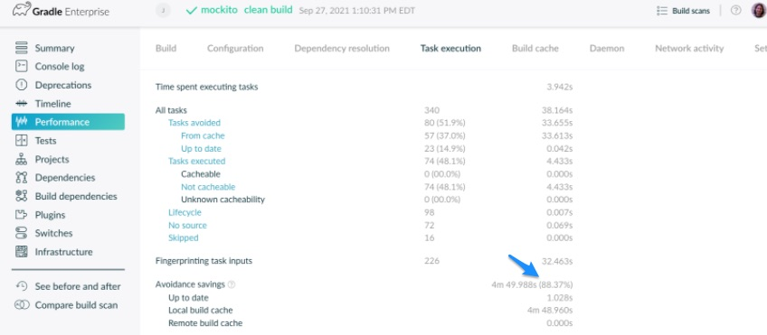
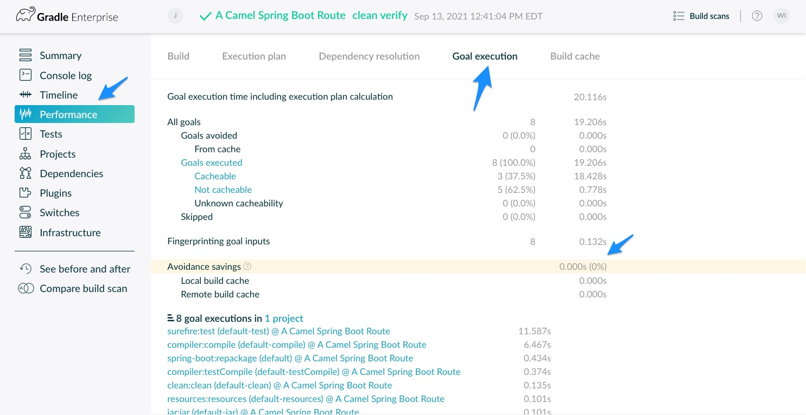
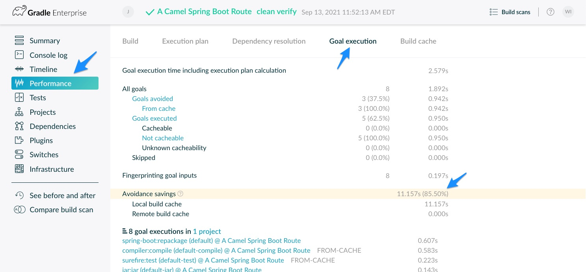

# Gradle and Maven Build Speed Challenge

## Quick Links

- [Instructions for Gradle](#instructions-for-gradle)
- [Instructions for Maven](#instructions-for-maven)

## How It Works

Contestants will get a chance to speed up their Gradle and Maven builds by trying out our Gradle (https://docs.gradle.org/current/userguide/build_cache.html) or Maven (https://docs.gradle.com/enterprise/maven-build-cache/) Build Cache and can verify their results using our free Build Scan(tm)(https://scans.gradle.com/).

To participate, all you'll need to do is enable caching in scanning in Gradle, or add the free Gradle Enterprise extension to the Maven project of your choice and connect to our contest events server. You'll run a cached build, and post a screenshot of your cache savings from the free Build Scan(tm) interface.  The user with the highest cache avoidance savings % per-round will win!

# Instructions for Gradle

### Step 1 

Start with the Gradle project of your choice.  If you'd rather not use a real project that you are working on, feel free to clone an open source one!  Note that project details such as dependencies, console lofs, and failure messages will be captured during the scan.  Here's everything that the scan will pick up:  (https://docs.gradle.com/enterprise/gradle-plugin/#captured_information)

Here are some alternatives, but remember any Gradle project will do!

 - Spring example project for Gradle:  https://github.com/spring-guides/gs-gradle
 - Mockito OSS Project: https://github.com/mockito/mockito
 - Groovy OSS Project:  https://github.com/apache/groovy

### Step 2

Note:  For instructions on **Gradle 5.x and previous**, please see the instructions here: https://docs.gradle.com/enterprise/gradle-plugin/ 

Connect your project to our events server by adding the following to your settings.gradle or settings.gradle.kts file:

**Groovy**

settings.gradle
```
plugins {
   id 'com.gradle.enterprise' version '3.7'
}

 ...

gradleEnterprise {
    server = "https://events.gradle.com/"
}
```
You may use the sample settings.gradle file included in this project if you'd like.

**Kotlin**

settings.gradle.kts
```
plugins {
  id("com.gradle.build-scan").version("3.7")
}

...

gradleEnterprise {
    server = "https://events.gradle.com/"
}
```

### Step 3

Enable caching in your build by adding the following to your gradle.properties file:

```
org.gradle.caching=true
```
You may use the sample gradle.properties file included in this project if you'd like.

### Step 4

Run a build with the standard:

>gradle build

Or you can use the gradlew wrapper if you prefer. The first build will get a baseline score, and will publish a Build Scan(tm) for you to view. Feel free to check it out! For the contest, the most important screen will be Performance -> Task execution -> Avoidance Savings:


The first time you run it, nothing will have been cached, so your avoidance will be 0% on the first pass.

### Step 5

Run the build again, using the same command you used in Step 4. This will run the same build again, but will pull reusable entries from the Gradle Build Cache.  This time you should see significant avoidance savings!



See the event organizer for information on how to publish your results.


# Instructions for Maven

### Step 1

Start with the Maven project of your choice.  If you'd rather not use a real project that you are working on, feel free to clone an open source one!  Note that project details such as dependencies, console logs, and failure messages will be captured during the scan. Here's everything that the scan will pick up:  (https://docs.gradle.com/enterprise/gradle-plugin/#captured_information)

Here are some alternatives, but remember any Maven project will do!

- Maven Multi-Module Example (https://github.com/jitpack/maven-modular)
- Spring Boot Apache Camel Archetype:
```
mvn archetype:generate \
  -DarchetypeGroupId=org.apache.camel.archetypes \
  -DarchetypeArtifactId=camel-archetype-spring-boot
```
- Maven Build Scan Quickstart (https://github.com/gradle/maven-build-scan-quickstart)

Create a hidden directory (if it doesn't already exist) in the project root called .mvn.  You can use your IDE.  Alternatively, in Windows you can use the File Explorer, or for Linux/Mac/UNIX you can run:

>mkdir .mvn

### Step 2

Create a file called extensions.xml inside of the .mvn directory, if it doesn't already exist, and add the following code snippet:

```
<extensions>
    <extension>
        <groupId>com.gradle</groupId>
        <artifactId>gradle-enterprise-maven-extension</artifactId>
        <version>1.11</version>
    </extension>
</extensions>
```

If the file already exists, just add the 'extension' XML block to whatever is already there:

```
<extensions>

   ...

    <extension>
        <groupId>com.gradle</groupId>
        <artifactId>gradle-enterprise-maven-extension</artifactId>
        <version>1.11</version>
    </extension>

  ...

</extensions>
```
You may use the sample extensions.xml file included in this project if you'd like.

### Step 3

Create a configuration file for the plugin in .mvn called gradle-enterprise.xml.  This file contains temporary credentials which will work for the duration of ApacheCon against our public Gradle Enterprise instance.  Note that this instance will not be available after the show, but you can always contact us to set up another one!

```
<gradleEnterprise>
    <server>
        <url>https://events.gradle.com/</url>
    </server>
    <buildCache>
        <remote>
            <storeEnabled>false</storeEnabled>
            <server>
                <credentials>
                    <username>mavenspeed</username>
                    <password>m@\/3n$43eC!</password>
                </credentials>
            </server>
        </remote>
    </buildCache>
</gradleEnterprise>
```

You may use the sample gradle-enterprise.xml file included if you'd like.

### Step 4

Run the first build with:

>mvn clean verify

The first build will get a baseline score, and will publish a Build Scan(tm) for you to view.  Feel free to check it out!  For the contest, the most important screen will be Performance -> Goal execution -> Avoidance Savings:



The first time you run it, nothing will have been cached, so your avoidance will be 0% on the first pass.

### Step 5
  
Run the build again, using the same command:

>mvn clean verify

The second will run the same build again, but will pull reusable entries from the Maven Build Cache.  This time you should see significant avoidance savings!



See the event organizer for information on how to publish your results.

